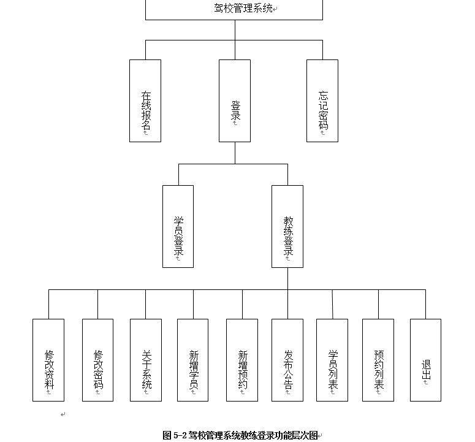

# 驾校管理系统

> 一个基于BS架构的驾校管理系统

## 目的

1. 实训项目（*本人大二学生党，不得不向恶势力低头...*）

2. 锻炼自己的水平

   

## 技术栈
1. 前端 
    - es6 
    - less
    - ejs
    - jQuery
    
2. 中间层 ajax

3. 后台 C# 6.0 

4. 数据库 SQLServer 

5. 框架 MVC

6. 配置 webpack

7. 移动端 （还未实现）

    

## 环境
1. 系统 Win10专业版 1709
2. 浏览器 360安全浏览器 8.1 |Chrome 63.0.3239.132
3. 数据库 SQL 2008R2 | SQL 2016
4. C# 4.5框架 （向下兼容）
5. 编辑器 
    - Visual Studio 2017 15.15.2 
    
    - Visual Studio Code 1.9.1
    
    - Sublime 3.0
    
      

## 截图

## 用法

学员账号：123456789@qq.com,123456789@ww.com,123456789@ee.com

学员密码：111111

教练账号：12345678911,12345678922,12345678933

教练密码：111111

**教练注册 需在表中增加数据，unread 与 newstudent 列需设置为0**